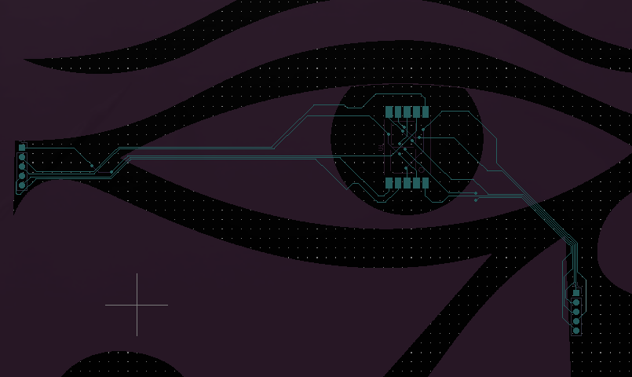
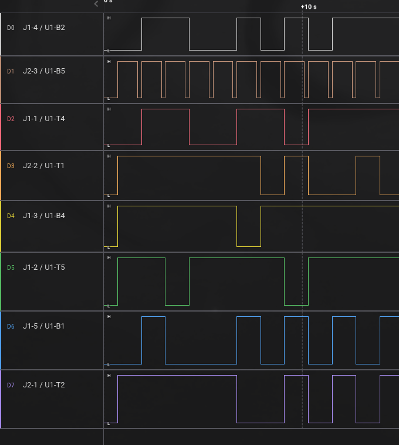
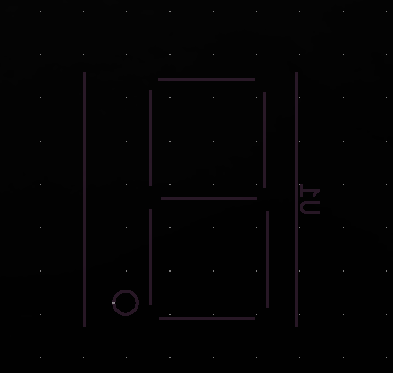

# Secret Code
Category: Hardware
Difficulty: easy
Points: 375

> To gain access to the tomb containing the relic, you must find a way to open the door. While scanning the surrounding area for any unusual signals, you come across a device that appears to be a fusion of various alien technologies. However, the device is broken into two pieces and you are unable to see the secret code displayed on it. The device is transmitting a new character every second and you must decipher the transmitted signals in order to retrieve the code and gain entry to the tomb.

---

# Analysis

The challenge provides a zip file containg the salae file `hw_secret_codes.sal` and the directory `broken_board` containing the gerber X2 job file `RA_CA_2023_6-job.gbrjob` with all layers in `gbr` files.

Opening the file in salae we see 8 channels. Channel 1 clearly stands out with  a 1 second high pulse as described in the pretext.

Opening the gerber job schematics in KiCad we see a 9 layer PCB schematic with a component-, mask-, paste- and silkscreen-layer for both the front and the back, as well as an edge cut-out layer.

When zooming in to the PCB with all layers shown we see an eye as well as 3 component groups 

The center group (`U1`) is a component pad with 10 connections, 5 on the top and 5 on the bottom. Labeling them left-to-right as `U1-T(1-5)` and `U1-B(1-5)`
The left group (`J1`) contains 5 diodes with traces running to `U1`. Labeling them top to bottom `J1-(1-5)`.
The right group (`J2`) also contains 5 diodes with the top 3 having traces running to `U1`. Labeling them top to bottom `J2-(1-5)`.
Most traces are on the front, with the back traces being used for crosses.
There are no non-conductive, short-circuited or interrupted traces running from either `J1` or `J2` to `U1`.

If we look at the back silk screen we see the corresponding signals written for the `J1` and `J2` diodes.

For analysis we've traced the tracings of the `J1` and `J2` diodes to `U1`, mapped them to the sal channels. For ease of analysis we created the following 3 tables.

| Diode | Diode trace | Type | SAL Channel | U1 pads | Pad trace | Net name | Note |
|-------|------------|------|-------------|---------|-----------|----------|------|
| `J1-1` | right | rect cmp | 2 | `U1-T4` | bottom | J1-Pad1 | |
| `J1-2` | right | oval cmp | 5 | `U1-T5` | bottom | J1-Pad2 | |
| `J1-3` | right | oval cmp | 4 | `U1-B4` | bottom | J1-Pad3 | |
| `J1-4` | left | oval cmp | 0 | `U1-B2` | bottom | J1-Pad4 | |
| `J1-5` | right | oval cmp | 6 | `U1-B1` | top | J1-Pad5 | |
| - | - | - | - | - | - |
| `J2-1` | left | rect cmp | 7 | `U1-T2` | bottom | J2-Pad1 | |
| `J2-2` | left | oval cmp | 3 | `U1-T1` | bottom | J2-Pad2 | |
| `J2-3` | left | oval cmp | 1 | `U1-B5` | top | J2-Pad3 | Clock? 1 sec high, 200ms low |
| `J2-4` | right | oval cmp | - | `U1-B3` | top | J2-Pad4 | |
| `J2-5` | left | oval cmp | - | `U1-T3` | bottom | J2-Pad5 | |


| | `U1-T1` | `U1-T2` | `U1-T3` | `U1-T4` | `U1-T5` |
|-|----|----|----|----|----|
| **SAL** | 3 | 7 | - | 2 | 5 |
| **Diode** | `J2-2` | `J2-1` | `J2-5` | `J1-1` | `J1-2` |
| - | - | - | - | - | - |
| | `U1-B1` | `U1-B2` | `U1-B3` | `U1-B4` | `U1-B5` |
| **Sal** | 6 | 0 | - | 4 | 1 |
| **Diode** | `J1-5` | `J1-4` | `J2-4` | `J1-3` | `J2-3` |


| **SAL** | 0 | 1 | 2 | 3 | 4 | 5 | 6 | 7 |
|-----|---|---|---|---|---|---|---|---|
| **Diode** | `J1-4` | `J2-3` | `J1-1` | `J2-2` | `J1-3` | `J1-2` | `J1-5` | `J2-1` |
| **U1** | `U1-B2` | `U1-B5` | `U1-T4` | `U1-T1` | `U1-B4` | `U1-T5` | `U1-B1` | `U1-T2` |


Also updated the sal file to reflect the `J1`/`J2` diode for a channel, as well as the corresponding `U1` pad.
.

Upon closer inspection of the `U1` component front silkscreen, it seems like it might a a seven-segment-display, which would make sense given the 8 signals, 1 of which being a clock.


# Solution
Starting with a CSV export of the sal channels to `digital.csv`

We can find diagram for pinning using a front/bottom pinning online.


Using the above diagram we can map the channels as follows:

| display pin | channel |
|-------------|---------|
| A | 2 |
| B | 5 |
| C | 4 | 
| D | 0 |
| E | 6 |
| F | 7 |
| G | 3 |
| DP | 1 |

Looking at the "source of all truths(tm)" (wikipedia) we can find a list of character representations for numbers, lower-case and upper case characters: [wikipedia seven-segment display character representations](https://en.m.wikipedia.org/wiki/Seven-segment_display_character_representations)

Decided to also make a CSV (`segments_dict.csv`) containing all the characters for easy reading and possible use in other CTFs.

Wrote initial version of a python script `solver.py` that looped over the signal CSV, filtering on channel one high's, print out the ascii representation of the signal as well as possible values from the dictionary. The output can be found in `res.txt`.

Adjusted the script to only take the first dictionary hit and concatenate the results to a single string. Since the dictionary starts with numbers any hex values would have a higher change of being valid.
This gave us the value `4854427b70307733325F63306d33355F6632306d5F77313768316E4021237d`.

Adjusting the script one last time to convert the hex value to ascii gives us the following output and the flag:
```
Using display signal channels [2,5,4,0,6,7,3] and dp 1
4854427b70307733325F63306d33355F6632306d5F77313768316E4021237d
HTB{p0w32_c0m35_f20m_w17h1n@!#}
```